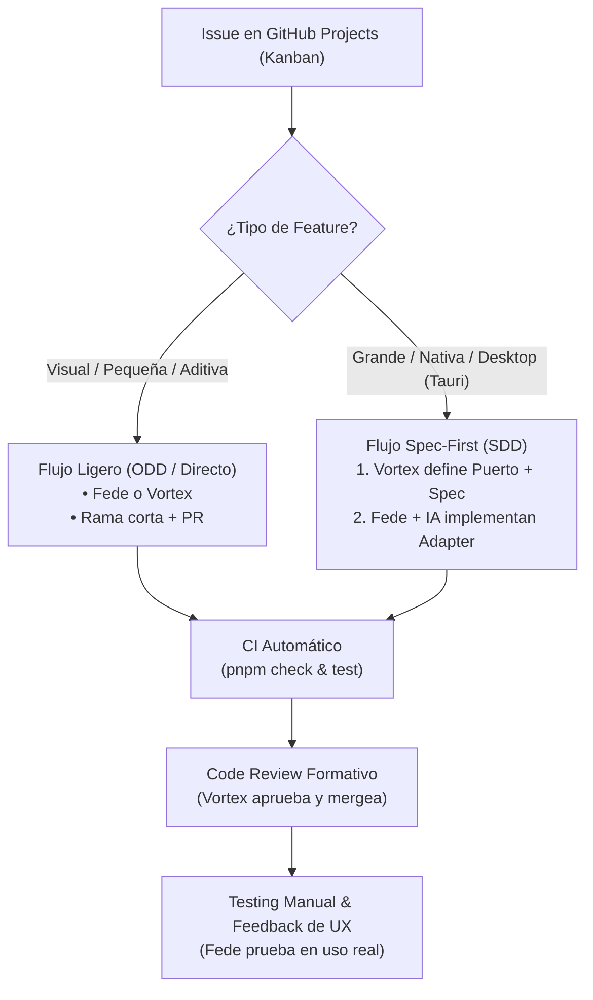

# Modelo de Colaboración y Metodología de Desarrollo

> Guía operativa para Vortex (Tech Lead), Fede (Vibe Coder / Lead Tester) y agentes de IA en Pomody.
> Diseñada para combinar agilidad en prototipado con blindaje arquitectónico riguroso.

---

## 1. Resumen Operativo y Roles

| Rol                          | Responsable | Foco Principal                                                                                                   | Herramientas Clave                                                           |
| :--------------------------- | :---------- | :--------------------------------------------------------------------------------------------------------------- | :--------------------------------------------------------------------------- |
| **Tech Lead & Arquitecto**   | **Vortex**  | Arquitectura hexagonal, lógica de dominio (FSM), puertos/contratos, revisión de código (70% del core).           | TypeScript estricto, Svelte 5, SDD / OpenSpec, GitHub Review.                |
| **Vibe Coder & Lead Tester** | **Fede**    | Feedback de UX en uso real, testing exploratorio de builds, prototipado visual y features de escritorio (Tauri). | Asistencia por IA (gentle-ai), componentes Svelte/Tailwind, GitHub Projects. |



---

## 2. Gestión del Trabajo: Kanban y Ciclo Evolutivo

El desarrollo se organiza en un ciclo de vida **evolutivo por versiones** (`v0.1`, `v0.2`, `v0.3` según [`roadmap.md`](./roadmap.md)), gestionado mediante un tablero **GitHub Projects**:

### Columnas del Tablero

1. **Backlog**: Ideas, propuestas y mejoras pendientes de priorizar.
2. **To Do**: Tareas priorizadas para la versión actual con criterios de aceptación claros.
3. **In Progress**: Tareas en desarrollo activo (máximo 1 o 2 en progreso simultáneo por persona).
4. **In Review**: Pull Requests abiertos esperando validación de CI y aprobación de Vortex.
5. **Done**: Código mergeado a `main`.

### Anatomía de un Issue

Todo issue asignado a desarrollo debe contener:

- **Objetivo**: Qué problema resuelve o qué valor aporta en una frase.
- **Criterios de Aceptación (DoD)**: Lista de verificación objetiva (ej. _"El temporizador se oculta al pulsar Zen"_).
- **Alcance / Capa**: Si afecta a `domain`, `components` o `adapters`.

---

## 3. Estrategia de Implementación según Alcance

### A. Flujo Ligero (Features Pequeñas o Visuales)

Aplica para componentes de presentación, ajustes de estilos Tailwind, copy o pequeñas mejoras de interfaz.

1. **Tomar la tarea**: Elegir un issue del tablero Kanban o un hallazgo menor de [`docs/review-findings.md`](./review-findings.md) y moverlo a _In Progress_.
2. **Crear rama** desde `main` (`feat/nombre-tarea` o `fix/nombre-tarea`).
3. **Implementar con asistencia de IA**: Generar o ajustar código limitado a `src/lib/components/`.
4. **Abrir PR**: Verificar que el diff sea pequeño (<150-200 líneas) para facilitar la revisión.

---

### B. Flujo Spec-First (Features Grandes o Nativas / Desktop)

Aplica para funcionalidades complejas que involucran APIs de sistema operativo (Tauri v2), persistencia o integraciones nativas (ej. widget flotante, detección de ventanas).

> [!IMPORTANT]
> **Regla de Inversión de Dependencias**: Fede o su agente **nunca** importan dependencias nativas (`@tauri-apps/*`) dentro del dominio ni en componentes compartidos. La versión Web SPA debe compilar siempre de forma 100% autónoma.

#### Paso 1: Definición del Contrato (Vortex) — _Solo si la feature toca infraestructura_

> [!NOTE]
> **Aclaración clave:** El diseño de puertos y adaptadores (como `IWindowService`) es un **ejemplo ilustrativo** reservado exclusivamente para cuando una feature interactúa con APIs del sistema operativo, almacenamiento o servicios externos. Si la feature es de UI, un nuevo componente visual o una mejora de presentación, **no requiere ningún adapter** y el agente debe avanzar directamente en el Flujo Ligero sin frenarse ni pedir contratos innecesarios.

1. Si la feature requiere desacoplar una API nativa, Vortex redacta la especificación técnica (fases de propuesta/diseño de SDD / OpenSpec).
2. Vortex crea el **puerto abstracto** en TypeScript puro dentro de `src/lib/domain/ports/` (ejemplo ilustrativo: `IWindowService.ts`):
   ```typescript
   export interface IWindowService {
   	setAlwaysOnTop(enabled: boolean): Promise<void>;
   	minimizeToWidget(): Promise<void>;
   }
   ```

#### Paso 2: Implementación del Adaptador (Fede + Agente IA)

1. Fede alimenta a su agente de IA con la spec y la interfaz ya definida por Vortex.
2. El agente implementa la funcionalidad **únicamente** en la capa de adaptadores:
   - `src/lib/adapters/tauri/` para la integración con Tauri.
   - `src/lib/adapters/web/` (stub / fallback sin efecto para el navegador).
3. Se enlaza el componente visual al puerto inyectado, sin acoplamiento directo a Tauri.

---

## 4. Directrices Críticas para el Agente de IA de Fede

Cuando Fede instruya a su agente de IA (vía `gentle-ai`, Cursor, Claude o similar), el agente debe cumplir estrictamente estas reglas:

> [!CAUTION]
>
> ### Reglas Innegociables para el Agente
>
> 1. **Pureza del Dominio (`src/lib/domain/`)**: Prohibido importar módulos de Svelte (`$app`, `$state`, etc.), APIs del DOM (`window`, `document`) o librerías de Tauri. El dominio es TypeScript puro.
> 2. **Aislamiento de Plataforma**: Las llamadas a `@tauri-apps/*` solo pueden existir dentro de `src/lib/adapters/tauri/`. Jamás importar Tauri en `src/lib/components/` o `src/lib/domain/`.
> 3. **Estado con Runes de Svelte 5**: Usar `$state`, `$derived` y `$props`. Prohibido usar stores legadas de Svelte 4 (`writable`, `derived`).
> 4. **Estándar de Commits**: Mensajes con formato Conventional Commits (`feat:`, `fix:`, etc.). **Nunca** incluir trailers como `Co-Authored-By` o menciones de autoría por IA.
> 5. **Verificación antes de finalizar**: Ejecutar siempre los comandos de control:
>    ```bash
>    pnpm check
>    pnpm test:unit
>    ```

---

## 5. Protocolo de Revisión y Testing

```text
[Desarrollo] ──> [PR Abierto] ──> [CI en Verde] ──> [Review de Vortex] ──> [Merge a main] ──> [Testing de Fede]
```

1. **Barrera Automática (CI)**: GitHub Actions corre `lint`, `check`, `test:unit` y `build`. Si CI falla, el PR no se revisa hasta que esté verde.
2. **Code Review Formativo (Vortex)**:
   - No solo busca bugs: explica el _por qué_ detrás de correcciones de diseño o tipado.
   - Garantiza que la arquitectura modular y el rendimiento (<30 MB RAM) se mantengan intactos.
3. **Testing de Calidad y Feedback de UX (Fede)**:
   - Fede prueba la versión en uso cotidiano (dogfooding).
   - Reporta fricciones, sensaciones de uso o bugs en issues de GitHub con pasos de reproducción claros y capturas.

---

## 6. Acelerador de Productividad: GitHub CLI (`gh`)

Tanto ustedes como sus agentes de IA pueden apoyarse en `gh` para operar sobre GitHub sin salir de la terminal ni cambiar de contexto:

| Tarea                         | Comando CLI                    | Utilidad para el Agente / Desarrollador                                              |
| :---------------------------- | :----------------------------- | :----------------------------------------------------------------------------------- |
| **Listar tareas activas**     | `gh issue list --assignee @me` | Identificar rápidamente el próximo issue asignado en el tablero.                     |
| **Consultar requerimientos**  | `gh issue view <id>`           | Inyectar la descripción y criterios de aceptación directamente al contexto de la IA. |
| **Abrir Pull Request**        | `gh pr create --fill`          | Crear el PR de inmediato asociando la rama al issue sin abrir el navegador.          |
| **Verificar estado de CI**    | `gh pr checks`                 | Comprobar si las GitHub Actions pasaron en verde antes de solicitar review.          |
| **Leer feedback de revisión** | `gh pr view --comments`        | Inspeccionar los comentarios formativos de Vortex directo en la consola.             |
