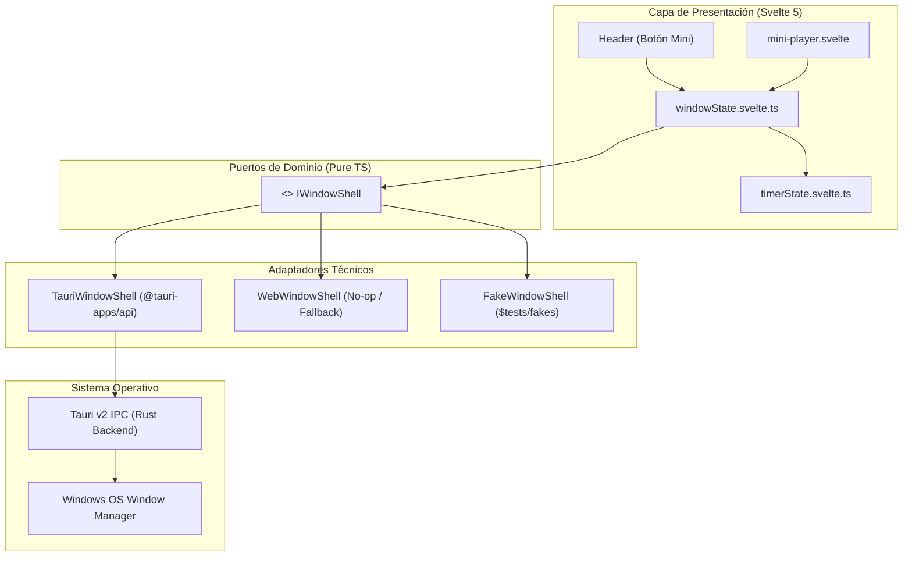

# Especificación Técnica: Modo Compacto / Mini-Player (v0.3 / Milestone 3)

> Documento de diseño técnico, contratos de arquitectura hexagonal y especificación de interfaz para el Mini-Player de Pomody en Windows Desktop (Tauri v2).
>
> El **por qué** de cada decisión está en [`decisions.md`](./decisions.md). Este documento define **qué** se construye y **cómo** se integra.

---

## 1. Contexto y Objetivos

El **Mini-Player** da respuesta al requerimiento **P1 del Milestone 3** ([`docs/roadmap.md`](../../roadmap.md)), ofreciendo a los desarrolladores y usuarios una vista ultra-compacta, periférica y flotante del temporizador mientras trabajan en sus aplicaciones principales (IDEs, terminales, navegadores).

- **Filosofía**: Minimalismo Zen sin saltos visuales (_no layout shift_). En reposo muestra únicamente lo esencial; en hover revela controles secundarios hacia la izquierda sin mover el botón primario.
- **Aislamiento Hexagonal**: Cero acoplamiento a APIs nativas en la capa de dominio o presentación. La comunicación con el sistema operativo se realiza a través de un puerto abstracto (`IWindowShell`) con adaptadores especializados para Tauri v2 y Web.
- **Paridad Web/Desktop**: En Windows (Tauri) controla la ventana nativa y la fija en modo _Always on Top_; en Web (Cloudflare Pages) opera pasivamente desactivando la acción nativa de ventana sin provocar errores de ejecución ni romper los tests en Vitest.

---

## 2. Arquitectura de Dominio y Puertos



### 2.1. Contrato del Puerto (`src/lib/domain/ports/window-shell.port.ts`)

```typescript
export interface WindowDimensions {
	readonly width: number;
	readonly height: number;
}

export interface IWindowShell {
	/** Retorna verdadero si la plataforma actual soporta manipulación de ventana nativa */
	readonly isSupported: boolean;

	/** Entra en modo compacto redimensionando la ventana y activando Always-on-Top */
	enterMiniPlayer(dimensions?: WindowDimensions): Promise<void>;

	/** Restaura la ventana a su tamaño normal (800x650px) y desactiva Always-on-Top */
	restoreMainWindow(): Promise<void>;

	/** Consulta el estado actual de fijación al frente */
	isAlwaysOnTop(): Promise<boolean>;
}
```

### 2.2. Estado Reactivo (`src/lib/state/window.svelte.ts`)

Gestiona el estado reactivo del modo compacto usando Svelte 5 Runes:

```typescript
class WindowState {
	isMiniPlayer = $state(false);
	isAlwaysOnTop = $state(false);

	constructor(private readonly shell: IWindowShell) {}

	async toggleMiniPlayer(): Promise<void> {
		if (this.isMiniPlayer) {
			await this.shell.restoreMainWindow();
			this.isMiniPlayer = false;
			this.isAlwaysOnTop = false;
		} else {
			await this.shell.enterMiniPlayer(MINI_WINDOW_DIMENSIONS);
			this.isMiniPlayer = true;
			this.isAlwaysOnTop = true;
		}
	}

	async restore(): Promise<void> {
		if (!this.isMiniPlayer) return;
		await this.shell.restoreMainWindow();
		this.isMiniPlayer = false;
		this.isAlwaysOnTop = false;
	}
}
```

---

## 3. Especificación de UI y Ergonomía del Mini-Player

Basado en la especificación de diseño ([`design.md`](./design.md)):

### 3.1. Topología del Layout (3 Columnas con Barra Flotante)

```text
Estado en Reposo (Rest State):
┌────────────────────────────────────────────────────────────────────────┐
│ [Icon] Task name...          24:18                               [▶]   │
│  ═══════════════════════════════════════════════════════════════════   │
└────────────────────────────────────────────────────────────────────────┘

Estado en Hover (Hover State - Revelación Progresiva):
┌────────────────────────────────────────────────────────────────────────┐
│ [Icon] Task name...          24:18               [↺] [⏭] [⤢]     [▶]   │
│  ═══════════════════════════════════════════════════════════════════   │
└────────────────────────────────────────────────────────────────────────┘
```

1. **Columna Izquierda (Estado y Tarea)**:
   - **Ícono semántico**: `CircleDot` para `focus` (`bg-accent-foam/10 text-accent-foam`), `Leaf` para `shortBreak` (`bg-accent-pine/10 text-accent-pine`) y `Sprout` para `longBreak` (`bg-accent-iris/10 text-accent-iris`).
   - **Título de la tarea**: Texto truncado con elipsis en reposo. En hover sobre la región, se activa animación marquee suave si el texto excede el espacio.
   - **Fallback sin tarea (`Free focus`)**: Muestra `Free focus` (o `Foco libre` según idioma) en cursiva atenuada.
2. **Columna Central (Temporizador)**:
   - Centrado absoluto (`absolute left-1/2 -translate-x-1/2`).
   - Dígitos tabulares (`text-sm font-medium tabular-nums`) para evitar oscilaciones de ancho al cambiar de segundo.
3. **Columna Derecha (Botonera Anclada)**:
   - **Botón `[Play/Pause]` Anclado**: Fijo en el extremo derecho sin layout shift.
   - **Revelación en Hover**: Los botones secundarios (`[Reset]`, `[Skip]`, `[Restaurar]`) se descubren con transición de opacidad hacia la izquierda del botón de Play.
4. **Barra de Progreso Flotante**:
   - Altura de 2px con margen (`mx-3 mb-1.5 rounded-full`) y color según el modo actual. Cero texto de porcentaje numérico.

### 3.2. Región de Arrastre e Interacción en WebView2

- **Atribución elemento por elemento**: el atributo nativo `data-tauri-drag-region` se aplica a cada elemento que debe arrastrar —el contenedor de la columna izquierda, su ícono, su título, el contenedor de la columna central y el texto del timer—. **No se hereda a los hijos** en Tauri v2 y, como las columnas cubren la totalidad del raíz, aplicarlo solo al contenedor general deja la ventana inmovible.
- **Aislamiento de la botonera**: el contenedor de botones interactivos (`[Play/Pause]`, `[Reset]`, `[Skip]`, `[Restaurar]`) **no lleva el atributo**, en ningún caso. No se desactiva con `data-tauri-drag-region="false"` sino por omisión: el diseño es _opt-in_, de modo que cualquier elemento nuevo nace sin drag y WebView2 procesa los clics sin confundirlos con arrastres. Ver [`003-tauri-frameless-window-quirks.md`](../../learnings/003-tauri-frameless-window-quirks.md).
- **Atajos de teclado**: La tecla `Escape` o el atajo global de alternancia devuelven la ventana a su tamaño completo.

---

## 4. Integración y Contratos con Tauri v2

### 4.1. Configuración de Restricciones (`src-tauri/tauri.conf.json`)

La ventana principal posee restricciones mínimas por defecto (`minWidth: 480`, `minHeight: 500`). Para permitir el modo compacto:

1. **Estrategia Dinámica**:
   Antes de invocar `setSize(LogicalSize(260, 60))`, el adaptador debe llamar a `setMinSize(LogicalSize(200, 50))`.
2. **Restauración**:
   Al volver a la vista principal, se restablece `setMinSize(LogicalSize(480, 500))` y `setSize(LogicalSize(800, 650))`.

### 4.2. Permisos y Capabilities (`src-tauri/capabilities/default.json`)

Tauri v2 opera bajo un modelo estricto de seguridad de permisos. Se deben habilitar los siguientes permisos en la capacidad por defecto:

```json
{
	"permissions": [
		"core:default",
		"core:window:allow-set-size",
		"core:window:allow-set-min-size",
		"core:window:allow-set-always-on-top",
		"core:window:allow-set-position",
		"core:window:allow-set-focus"
	]
}
```

---

## 5. Estrategia de Testing y Fakes

### 5.1. Doble de Test (`src/testing/fakes/platform/fake-window-shell.ts`)

Para probar la interacción del Mini-Player en Vitest Browser sin depender del runtime de Windows:

```typescript
export class FakeWindowShell implements IWindowShell {
	isSupported = true;
	isMini = false;
	alwaysOnTop = false;

	async enterMiniPlayer(dimensions?: WindowDimensions): Promise<void> {
		this.isMini = true;
		this.alwaysOnTop = true;
	}

	async restoreMainWindow(): Promise<void> {
		this.isMini = false;
		this.alwaysOnTop = false;
	}

	async isAlwaysOnTop(): Promise<boolean> {
		return this.alwaysOnTop;
	}
}
```

### 5.2. Cobertura de Aceptación (Vitest Browser)

- Verificar que al entrar en hover sobre el mini-player se revelan los botones de acción sin alterar la posición del botón Play.
- Verificar que el clic en el botón de restaurar o pulsar `Escape` invoca `restoreMainWindow()`.
- Validar que el título de la tarea activa y el modo del temporizador se sincronizan en tiempo real con `timerState` y `tasksState`.

---

## 6. Plan de Ejecución por Slices Verticales (< 400 LOC)

Para preservar la regla estricta de **menos de 400 LOC por Pull Request**:

| PR / Slice                                    | Alcance Técnico                            | Entregables Principales                                                                                                                                                         |
| :-------------------------------------------- | :----------------------------------------- | :------------------------------------------------------------------------------------------------------------------------------------------------------------------------------ |
| **PR 3.1: Cimientos de Ventana Nativa**       | Infraestructura y puerto hexagonal         | `IWindowShell`, adaptadores `TauriWindowShell` y `WebWindowShell`, `windowState.svelte.ts`, permisos en Tauri v2 y `FakeWindowShell`.                                           |
| **PR 3.2: Componente Mini-Player (#102)**     | UI compacta del widget                     | Componente `mini-player.svelte` (kebab-case), soporte `data-tauri-drag-region` elemento por elemento, claves i18n `mini_player_*` y suite de tests en Chromium.                 |
| **PR 3.3: Integración con la ventana (#103)** | Conmutación de ventana, disparador y atajo | `setDecorations(false)` / `setResizable(false)` en el puerto y el adaptador, permisos correspondientes en `capabilities/default.json`, disparador en `Header` y atajo `Escape`. |

---

## 7. Criterios de Aceptación (Definition of Done)

- [ ] Cero importaciones de `@tauri-apps/api` dentro de la capa `src/lib/domain/`.
- [ ] La aplicación web en producción compila y opera normalmente (`WebWindowShell` no-op seguro).
- [ ] El redimensionamiento nativo en Windows conmuta limpiamente entre 800x650px y 280x64px sin trabas de `minSize`.
- [ ] La bandera _Always on Top_ se activa automáticamente en modo mini y se desactiva al restaurar.
- [ ] Los botones interactivos responden al clic instantáneamente sin ser interceptados por el arrastre nativo.
- [ ] `pnpm check`, `pnpm lint`, `pnpm test:unit` y `pnpm test:browser` pasan al 100% con cero advertencias.
