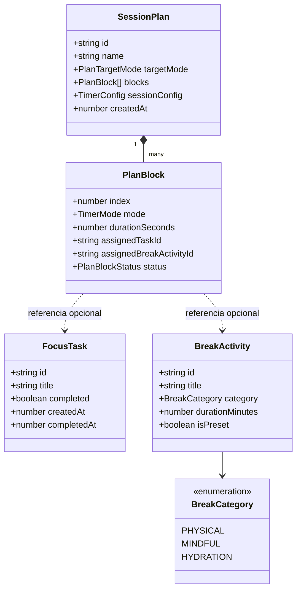
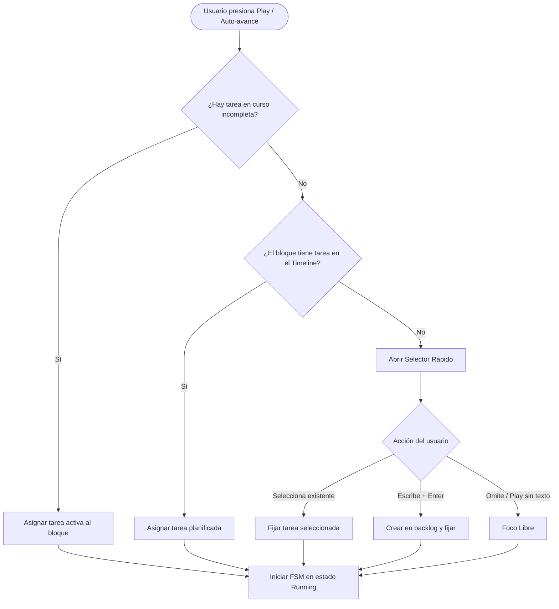
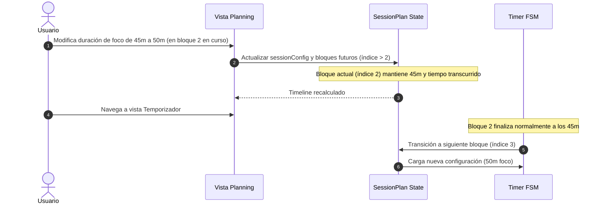

# Especificación Técnica: Tareas, Revitalización y Planificación (v0.2)

> Documento de diseño técnico y contratos de dominio para la implementación de las funcionalidades de Planificación, Mini To-Do y Catálogo de Revitalización en Pomody.

---

## 1. Contexto y Principios de Diseño

Pomody busca proteger el estado de flujo del usuario (_deep focus_) reduciendo al mínimo la fatiga de decisión y la fricción operativa. El sistema planteado para la versión **v0.2** introduce tres subsistemas complementarios que interactúan con el temporizador sin violar la arquitectura hexagonal ni saturar la pantalla principal:

1. **Tareas de Foco (`FocusTask`)**: Gestión liviana de objetivos de trabajo pendientes y completados.
2. **Revitalización y Descansos (`BreakActivity`)**: Catálogo reusable de hábitos y dinámicas saludables para pausas.
3. **Motor de Planificación (`SessionPlan`)**: Secuenciador temporal en forma de _Timeline_ cronológico proyectable por bloques o por horario límite.

### Principios Arquitectónicos Clave

- **Cero dependencias en el dominio**: Toda la lógica matemática, secuencias de bloques y validaciones son TypeScript puro bajo `src/lib/domain/`.
- **Cero fricción en el inicio (Play)**: El temporizador jamás se traba ni exige formularios obligatorios pesados; opera con continuidad inteligente y fallbacks instantáneos (_Foco libre_).
- **Mutabilidad hacia adelante (Forward-only)**: Las ediciones en caliente a la planificación impactan únicamente a partir del siguiente bloque; el bloque en curso es inmutable en sus ticks para preservar la coherencia temporal.
- **Persistencia desacoplada**: Contratos de repositorio abstractos (`ITaskRepository`, `IBreakActivityRepository`, `ISessionPlanRepository`) con implementación inicial síncrona en `localStorage`.

---

## 2. Modelo Ontológico de Dominio

Se establece una estricta separación de entidades para evitar el antipatrón de mezclar objetivos de trabajo descartables con hábitos de salud recurrentes.



### Contratos TypeScript (`src/lib/domain/`)

```typescript
export type BreakCategory = 'physical' | 'mindful' | 'hydration';

export interface FocusTask {
	readonly id: string;
	readonly title: string;
	readonly completed: boolean;
	readonly createdAt: number;
	readonly completedAt?: number;
}

export interface BreakActivity {
	readonly id: string;
	readonly title: string;
	readonly category: BreakCategory;
	readonly durationMinutes: number;
	readonly isPreset: boolean;
}

export type PlanTargetMode = 'blocks' | 'end_time';
export type PlanBlockStatus = 'pending' | 'in_progress' | 'completed' | 'skipped';

export interface PlanBlock {
	readonly index: number;
	readonly mode: 'focus' | 'shortBreak' | 'longBreak';
	readonly durationSeconds: number;
	readonly assignedTaskId?: string;
	readonly assignedBreakActivityId?: string;
	readonly status: PlanBlockStatus;
}

export interface SessionPlan {
	readonly id: string;
	readonly targetMode: PlanTargetMode;
	readonly blocks: readonly PlanBlock[];
	readonly sessionConfig: TimerConfig;
	readonly createdAt: number;
}
```

---

## 3. Dinámica del Temporizador y Asignación de Tareas

### Flujo en Inicio de Bloque de Foco: Continuidad Inteligente

Al pulsar **Play** (o transicionar automáticamente si está activo el auto-avance):

1. **¿Existe una tarea activa incompleta?**
   - **Sí**: El temporizador arranca inmediatamente con esa tarea asociada en el _Task Pill_. Fricción cero.
2. **¿No hay tarea activa o la anterior fue tildada como completada?**
   - Se despliega un selector rápido e interactivo (_Task Pill popover_) que permite:
     - Seleccionar una tarea existente del backlog.
     - Escribir un texto y presionar `Enter` para crearla y seleccionarla automáticamente.
     - Presionar `Play` o `Escape` directamente para iniciar en **"Foco libre"** (fallback automático sin forzar nombres).



### Operaciones durante el Bloque de Foco

Desde el _Task Pill_ en pantalla principal, el usuario puede en cualquier momento:

- **Tachar tarea (`completed = true`)**: Se guarda el timestamp de completitud. El temporizador **sigue corriendo**. El usuario puede pulsar el Task Pill para seleccionar una nueva tarea del backlog o dejarla completada hasta el final del bloque.
- **Editar título**: Corrección tipográfica en caliente.
- **Intercambiar tarea**: Desasociar la actual y elegir otra del backlog.

### Dinámica en Bloques de Descanso: Revitalización Automática

1. Al transicionar a `shortBreak` o `longBreak`:
   - Si el bloque tenía una `BreakActivity` asignada en el _Timeline_, se muestra directamente.
   - Si no tenía ninguna asignada, el motor de **Revitalización Automática** selecciona una actividad del catálogo filtrada por duración y categoría, evitando repetir la última utilizada.
2. La vista de descanso muestra:
   - Título e ícono de la actividad (ej. _"Estiramiento de cuello y hombros"_ o _"Vaso de agua grande"_).
   - Botón de **Rotar (Shuffle)** para cambiar de actividad en un clic si el usuario prefiere otra.
   - Opción de apagar la revitalización desde _Settings_ para quien prefiera descansos en blanco.

---

## 4. Motor de Planificación (`SessionPlan`)

La pestaña de navegación **Planning** permite estructurar la sesión proyectando una secuencia cronológica de bloques discretos (_Timeline_).

### Modos de Generación

#### A. Por Cantidad de Bloques

El usuario elige la cantidad total de pomodoros de foco $N$, junto con las duraciones y la frecuencia del descanso largo.

- **Entrada de ejemplo**: 6 pomodoros de 45m foco, 15m descanso corto, 30m descanso largo cada 4 rondas.
- **Secuencia generada**:
  $$\text{F}(45) \rightarrow \text{D}(15) \rightarrow \text{F}(45) \rightarrow \text{D}(15) \rightarrow \text{F}(45) \rightarrow \text{D}(15) \rightarrow \text{F}(45) \rightarrow \text{DL}(30) \rightarrow \text{F}(45) \rightarrow \text{D}(15) \rightarrow \text{F}(45)$$
- **Regla de cierre**: El plan finaliza estrictamente en el último bloque de foco, omitiendo el descanso final innecesario.

#### B. Por Horario Límite (_End Time Budget_)

El usuario define la hora de inicio (actual o programada) y una hora tope de finalización (ej. de 13:00 a 21:00).

- **Ajuste por bloques completos**: El planificador calcula cuántos ciclos caben en la ventana temporal sin cortar bloques de foco a la mitad.
- **Tratamiento del sobrante residual**: Si al final de la jornada queda un remanente menor a un bloque completo de foco (ej. sobran 15 minutos), este margen se descarta del plan y se visualiza como "Margen libre", garantizando que todos los bloques de trabajo sean íntegros.

### Sincronización en Caliente y Modificaciones Hacia Adelante

- **Settings vs Planning**: _Settings_ almacena los valores por defecto globales del usuario. _Planning_ toma esos valores como plantilla para la sesión del día, permitiendo modificarlos localmente sin sobreescribir la configuración global.
- **Edición durante la sesión**: Si el usuario agrega bloques, elimina bloques pendientes o cambia las duraciones en el Planning mientras corre el temporizador:
  - El **bloque activo en curso no se interrumpe, no se reinicia y no altera sus segundos restantes**.
  - Todos los cambios estructurales y de duración aplican a partir del **siguiente bloque en la secuencia**.



---

## 5. Puertos e Interfaces (Arquitectura Hexagonal)

Ubicados en `src/lib/domain/ports/`:

### `ITaskRepository`

```typescript
export interface ITaskRepository {
	getAll(): Promise<readonly FocusTask[]>;
	getPending(): Promise<readonly FocusTask[]>;
	save(task: FocusTask): Promise<void>;
	saveBatch(tasks: readonly FocusTask[]): Promise<void>;
	delete(taskId: string): Promise<void>;
	clearCompleted(): Promise<void>;
}
```

### `IBreakActivityRepository`

```typescript
export interface IBreakActivityRepository {
	getAll(): Promise<readonly BreakActivity[]>;
	getByCategory(category: BreakCategory): Promise<readonly BreakActivity[]>;
	save(activity: BreakActivity): Promise<void>;
	delete(activityId: string): Promise<void>;
	resetToDefaults(): Promise<void>;
}
```

### `ISessionPlanRepository`

```typescript
export interface ISessionPlanRepository {
	getActivePlan(): Promise<SessionPlan | null>;
	saveActivePlan(plan: SessionPlan): Promise<void>;
	clearActivePlan(): Promise<void>;
}
```

---

## 6. Hoja de Ruta de Implementación para v0.2

Para evitar conflictos y permitir delegación limpia:

1. **Paso 1 (Dominio Puro)**:
   - Crear entidades, validadores y funciones matemáticas de proyección temporal en `src/lib/domain/tasks/` y `src/lib/domain/planning/` con cobertura 100% en Vitest.
   - Definir puertos en `src/lib/domain/ports/`.
2. **Paso 2 (Adaptadores de Persistencia Local)**:
   - Implementar `LocalStorageTaskRepository`, `LocalStorageBreakRepository` y `LocalStoragePlanRepository` en `src/lib/adapters/storage/`.
3. **Paso 3 (Task Pill & Integración en Timer UI)**:
   - Componente `task-pill.svelte` bajo `src/lib/components/timer/` con atajos de teclado, búsqueda y creación rápida.
   - Integración con el estado reactivo `timer.svelte.ts`.
4. **Paso 4 (Pestaña Planning & Timeline)**:
   - Activar pestaña `Planning` en el `header.svelte`.
   - Crear vista `src/lib/components/planning/planning-view.svelte` con renderizado del Timeline y selector de modo (Cantidad vs Horario límite).
5. **Paso 5 (Catálogo de Revitalización & Shuffle)**:
   - Sembrado de 10 sugerencias iniciales saludables (hidratación, estiramiento postural, descanso visual 20-20-20, respiración).
   - Componente de sugerencia en la pantalla de descanso con botón de rotación (_shuffle_).
