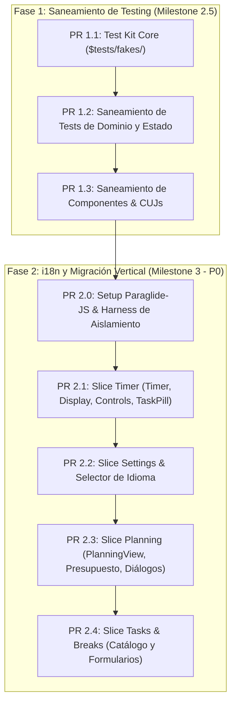

# Estrategia de Testing, Saneamiento y Migración a i18n

> Marco metodológico y plan de ejecución incremental para sanear la suite de tests, desacoplar aserciones frágiles e incorporar internacionalización (i18n) sin regresiones ni sobrecarga en el CI.

---

## 1. Resumen Ejecutivo y Diagnóstico

### Diagnóstico de la Suite Actual

La base de tests actual de Pomody presenta tres vicios estructurales acumulados durante la fase inicial de desarrollo:

1. **Duplicación de dobles de test (Mocks dispersos)**: Implementaciones ad-hoc como `MockBreakActivityRepository` y `MockTaskRepository` están clonadas en más de 6 archivos de test, con comportamientos inconsistentes.
2. **Acoplamiento a implementación interna del DOM**: Aserciones que inspeccionan atributos SVG privados (`circle[stroke-width="2.5"]`), selectores CSS o tags auxiliares en lugar de validar comportamiento y accesibilidad observable.
3. **Acoplamiento a cadenas de texto literales**: Búsqueda rígida de textos en inglés (`'Start timer'`, `'FOCUS'`), lo cual provocaría la rotura masiva de tests ante cualquier cambio de copy o traducción.
4. **Ausencia de Critical User Journeys (CUJ)**: Faltan pruebas integrales que validen el flujo de usuario de extremo a extremo (configurar timer -> asignar tarea -> correr intervalo -> validar persistencia y métricas).

### Decisión de Arquitectura y Estrategia

Se adopta una **estrategia secuencial en dos fases con división vertical (Vertical Slicing)**:

- **Fase 1**: Saneamiento de infraestructura y desacople de DOM/mocks **sin tocar textos de i18n**, manteniendo los textos base en inglés.
- **Fase 2**: Integración de `@inlang/paraglide-js` en memoria (sin routing en URL) y migración vertical componente por componente junto a sus tests.

---

## 2. Mapa de Ejecución por Fases (Desglose de PRs < 400 LOC)

Para cumplir estrictamente con el límite de **400 líneas por Pull Request** establecido en el CI, el trabajo se divide en 7 unidades atómicas:



---

## 3. Fase 1 — Saneamiento y Cimientos de Testing

### PR 1.1: Creación del Test Kit Compartido (`$tests/`)

- **Ubicación**: `src/testing/` (fuera de `src/lib/` para garantizar cero contaminación en los bundles de producción).
- **Alias de compilador**: Configurar el alias `$tests/` mapeado a `src/testing/` en `tsconfig.json` y `vite.config.ts`.
- **Regla estricta**: Cero barrel files (`index.ts`). Cada fake y fixture se importa desde su ruta concreta.
- **Entregables**:
  - `src/testing/fakes/repositories/fake-task-repository.ts`: Implementación en memoria respetando el contrato `ITaskRepository`.
  - `src/testing/fakes/repositories/fake-break-activity-repository.ts`: Implementación en memoria respetando el contrato `IBreakActivityRepository`.
  - `src/testing/fakes/repositories/fake-session-plan-repository.ts`: Implementación en memoria respetando el contrato `ISessionPlanRepository`.
  - `src/testing/fakes/repositories/fake-daily-stats-repository.ts`: Implementación en memoria respetando el contrato `IDailyStatsRepository`.
  - `src/testing/fakes/repositories/fake-settings-storage.ts`: Implementación en memoria respetando el contrato `ISettingsStorage`.
  - `src/testing/fakes/engine/fake-ticker.ts`: Control manual determinista del tiempo para la FSM.
  - `src/testing/fakes/engine/fake-audio-notifier.ts`: Espía in-memory para eventos de audio.
  - `src/testing/fixtures/`: Factorías de entidades (`createTaskFixture`, `createBreakActivityFixture`, `createSessionPlanFixture`).

### PR 1.2: Saneamiento de Tests de Dominio y Estado

- **Objetivo**: Sustituir todas las definiciones duplicadas de `class Mock...` en la capa de estado (`src/lib/state/*.test.ts`) y adaptadores (`src/lib/adapters/**/*.test.ts`).
- **Alcance**:
  - `src/lib/state/breaks.test.ts`
  - `src/lib/state/planning.test.ts`
  - `src/lib/state/tasks.test.ts`
  - `src/lib/state/daily-stats.test.ts`
  - `src/lib/state/timer.test.ts`
- **Resultado**: Eliminación de más de 300 líneas de código duplicado y unificación de contratos de persistencia.

### PR 1.3: Saneamiento de Tests de Componentes y CUJs

- **Objetivo**: Reemplazar mocks en componentes visuales, sanear aserciones frágiles de DOM y crear la primera suite de Critical User Journeys.
- **Elevación de Accesibilidad Semántica**:
  - En lugar de inspeccionar `<circle stroke-width="2.5">`, actualizar `timer-arc.svelte` con semántica accesible explícita (`role="progressbar"`, `aria-valuenow`, `aria-valuemin="0"`, `aria-valuemax="100"`).
  - Los tests validan atributos ARIA y roles nativos (`getByRole('progressbar')`), nunca la estructura SVG privada.
- **Critical User Journeys (CUJ)**:
  - Crear `src/testing/cuj/core-session-journey.test.ts` validando el flujo: iniciar timer -> cambiar tarea activa -> completar bloque -> verificar actualización de contador diario y persistencia.
  - Mantener las cadenas base en inglés para no bloquearse por i18n.

---

## 4. Fase 2 — Internacionalización (i18n) e Integración Vertical

### PR 2.0: Setup de Runtime Paraglide-JS & Harness de Test

- **Instalación**: `@inlang/paraglide-js` compilando a funciones TypeScript puras y tree-shakeables.
- **Idiomas soportados**: Inglés base (`en`) y Español (`es`).
- **Estado reactivo**: Módulo `src/lib/state/locale.svelte.ts` gobernado por Svelte 5 Runes (`$state`), sincronizado con `localStorage` (`pomody_locale`).
- **Salvaguarda de Aislamiento en Vitest Browser**:
  - Configurar un hook de limpieza en el setup de tests (`vitest.setup.ts` o `$tests/i18n-harness.ts`):
    ```ts
    import { setLanguageTag } from '$lib/paraglide/runtime';
    import { afterEach } from 'vitest';

    afterEach(() => {
    	// Restablecer siempre el locale base para evitar fugas entre tests
    	setLanguageTag('en');
    });
    ```

### PR 2.1: Slice Vertical 1 — Timer

- **Componentes**: `Timer`, `TimerDisplay`, `TimerControls`, `TimerArc`, `TaskPill`, `BreakRevitalization`.
- **Traducción**: Migrar etiquetas (`FOCUS`, `SHORT BREAK`, `Start timer`, `Pause timer`, `Reset timer`) a `m.*()`.
- **Tests**: Actualizar `timer.svelte.test.ts` y `task-pill.svelte.test.ts` validando la renderización en el idioma activo del test.

### PR 2.2: Slice Vertical 2 — Settings & Selector de Idioma

- **Componentes**: `SettingsDrawer`, paneles de intervalos, toggles de sonido y nuevo `LanguageSelector` (Selector accesible de idioma con opciones English / Español).
- **Traducción**: Textos de configuración, descripciones de opciones y tooltips.
- **Tests**: Actualizar `settings.svelte.test.ts` y verificar que conmutar el idioma actualiza la UI en caliente sin recargar la página ni alterar rutas.

### PR 2.3: Slice Vertical 3 — Planning

- **Componentes**: `PlanningView`, `SessionBudget`, `PlanningCadenceConfig`, `EndSessionDialog`, `UnderflowAlert`.
- **Traducción**: Cabeceras de columna, estimaciones de tiempo, mensajes de alerta y confirmaciones.
- **Tests**: Actualizar `planning-view.svelte.test.ts` y suites asociadas utilizando los Fakes del Test Kit.

### PR 2.4: Slice Vertical 4 — Tasks & Breaks

- **Componentes**: `TaskItem`, `BreakCatalog`, `BreakCard`, `BreakFormDialog`, `BreakConfirmDialog`.
- **Traducción**: Categorías de descansos, textos de micro-guías, acciones CRUD de tareas y modales de confirmación destructiva.
- **Tests**: Actualizar suites de `breaks` y `tasks`.

---

## 5. Matriz de Criterios de Aceptación (DoD)

| Criterio                           | Validación                                                                                         |
| :--------------------------------- | :------------------------------------------------------------------------------------------------- |
| **Cero Mocks Duplicados**          | Ningún archivo de test declara `class Mock...` localmente; 100% usan `$tests/fakes/`.              |
| **Cero Aserciones de DOM Privado** | Ningún test busca tags `<circle>`, atributos `stroke-width` o clases CSS privadas.                 |
| **Paridad de Idiomas 100%**        | Todas las vistas (Timer, Planning, Settings, Modales) cuentan con claves completas en `en` y `es`. |
| **Persistencia de Idioma**         | El idioma seleccionado persiste en `localStorage` y se restaura al reabrir la app.                 |
| **Sin Fugas entre Tests**          | Vitest Browser ejecuta la suite completa en paralelo sin colisiones por `setLanguageTag`.          |
| **Presupuesto de PRs**             | Cada uno de los 7 PRs mantiene un delta menor a 400 líneas de código útil.                         |
| **Suite Verde & Tipado Estricto**  | `pnpm check`, `pnpm lint`, `pnpm test:unit` y `pnpm test:browser` pasan con cero advertencias.     |
